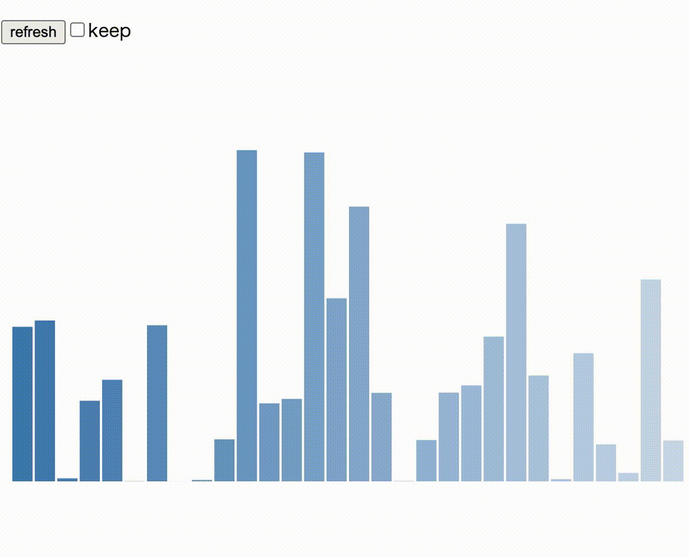
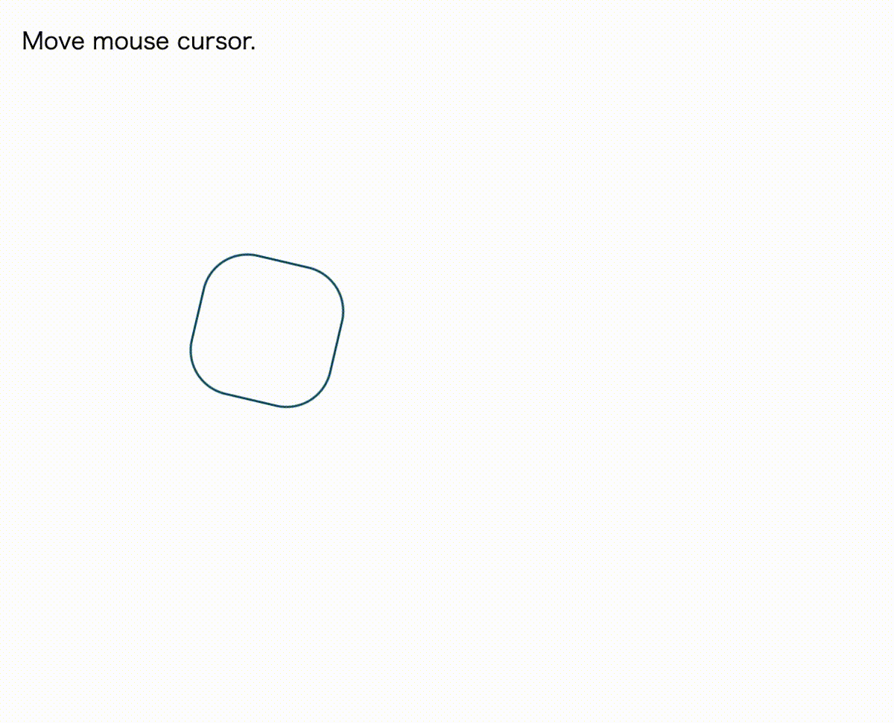
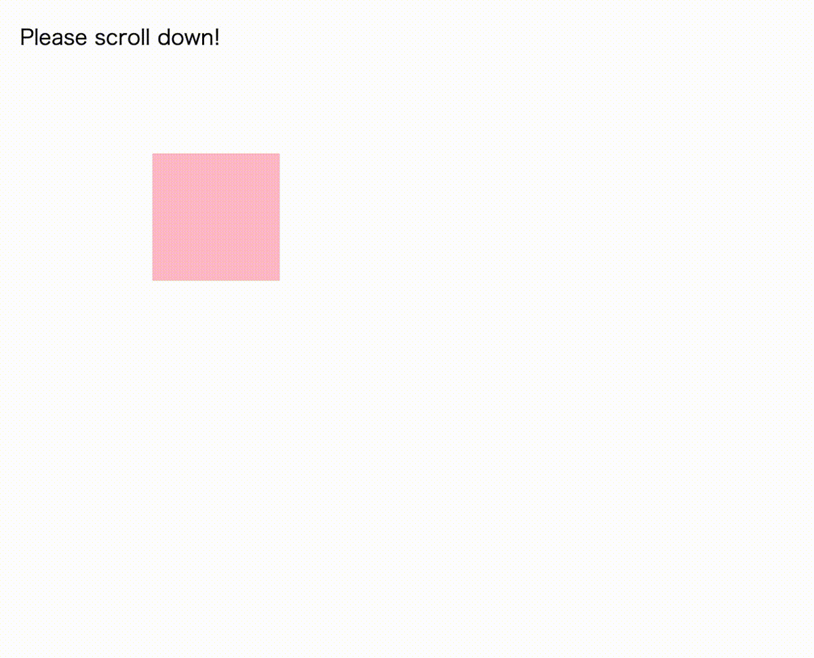
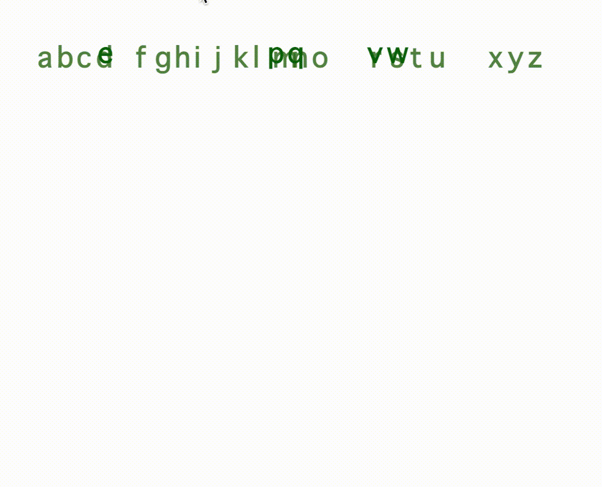

# react-animatable

  [](https://github.com/inokawa/react-animatable/actions/workflows/check.yml) [](https://github.com/inokawa/react-animatable/actions/workflows/demo.yml)

A powerful composable animation library for [React](https://github.com/facebook/react), built on [Web Animations API](https://developer.mozilla.org/en-US/docs/Web/API/Web_Animations_API) and React hook.





## Features

- Performant animation driven by native [Web Animations API (WAAPI)](https://developer.mozilla.org/en-US/docs/Web/API/Web_Animations_API).
- Easy integration with a few lines of code.
  - Supports any UI component libraries, [Material UI](https://github.com/mui/material-ui), [Chakra UI](https://github.com/chakra-ui/chakra-ui), [Ant Design](https://github.com/ant-design/ant-design), [Fluent UI](https://github.com/microsoft/fluentui), [Mantine](https://github.com/mantinedev/mantine) and the others.
  - Supports any CSS-in-JS libraries, [styled-components](https://github.com/styled-components/styled-components), [emotion](https://github.com/emotion-js/emotion), [stitches](https://github.com/stitchesjs/stitches), [vanilla-extract](https://github.com/vanilla-extract-css/vanilla-extract), [linaria](https://github.com/callstack/linaria), [compiled](https://github.com/atlassian-labs/compiled) and the others.
  - Supports [Next.js](https://github.com/vercel/next.js) and server-side rendering (SSR).
- HTML, SVG, Canvas and anything can be animated.
- [Tiny bundle size (currently about 2kB gzipped)](https://bundlephobia.com/package/react-animatable) and has zero dependencies. Of course treeshakeable
- Fully typed with [TypeScript](https://www.typescriptlang.org/), which is stricter than TypeScript's [lib.dom.d.ts](https://github.com/microsoft/TypeScript/blob/main/lib/lib.dom.d.ts).
- Composable and declarative APIs based on React hook.

## Demo

https://inokawa.github.io/react-animatable/

## Install

```sh
npm install react-animatable
```

### Requirements

- react >= 16.14

If you use ESM and webpack 5, use react >= 18 to avoid [Can't resolve `react/jsx-runtime` error](https://github.com/facebook/react/issues/20235).

And in some legacy browsers that does not support Web Animations API, [you may need to use polyfill](#use-polyfill).

## Usage

1. Define your animation with `useAnimation` hook.

> The hooks accepts [canonical keyframe format objects](https://developer.mozilla.org/en-US/docs/Web/API/Web_Animations_API/Keyframe_Formats#syntax) and [KeyframeEffect's options](https://developer.mozilla.org/en-US/docs/Web/API/KeyframeEffect/KeyframeEffect#parameters) as arguments, so check them before using this library.

2. Pass the return value of `useAnimation` to `ref` of element you want to control.

3. Call `play()`!

```tsx
import { useEffect } from "react";
import { useAnimation } from "react-animatable";

export const App = () => {
  // 1. Define your animation in WAAPI way
  const animate = useAnimation(
    [{ transform: "rotate(0deg)" }, { transform: "rotate(720deg)" }],
    {
      duration: 1000,
      easing: "ease-in-out",
    }
  );

  return (
    <button
      // 2. You have to pass animate to element you want to control
      ref={animate}
      onClick={() => {
        // 3. And play it!
        animate.play();
      }}
    >
      Click Me!
    </button>
  );
};
```

### Dynamic keyframe

Use `prev` and `args` for dynamic keyframe generation.

```tsx
import { useEffect } from "react";
import { useAnimation } from "react-animatable";

export const App = () => {
  // Define argument type
  const animate = useAnimation<{ x: number; y: number }>(
    (prev, args) => [
      // You can get current style from 1st argument
      { transform: prev.transform },
      // Get passed position from 2nd argument
      { transform: `translate(${args.x}px, ${args.y}px)` },
    ],
    {
      duration: 400,
      easing: "ease-in-out",
    }
  );

  useEffect(() => {
    // If you click somewhere, the circle follows you!

    const onClick = (e: MouseEvent) => {
      // Pass mouse position when animate
      animate.play({ args: { x: e.clientX, y: e.clientY } });
    };
    window.addEventListener("click", onClick);
    return () => {
      window.removeEventListener("click", onClick);
    };
  }, []);

  return (
    <div
      ref={animate}
      style={{
        position: "fixed",
        border: "solid 0.1rem #135569",
        borderRadius: "50%",
        height: "6rem",
        width: "6rem",
        top: "-3rem",
        left: "-3rem",
      }}
    />
  );
};
```

### Animation without CSS

Use `useAnimationFunction` for JS only animation.

```tsx
import { useState } from "react";
import { useAnimationFunction } from "react-animatable";

export const App = () => {
  const [value, setValue] = useState(0);
  const animate = useAnimationFunction<number>(
    ({ progress }, arg) => {
      // Do anything here!
      setValue(progress * arg);
    },
    {
      duration: 600,
      easing: "ease-in-out",
    }
  );
  useEffect(() => {
    animate.play({ args: 100 });
  }, []);

  return <progress value={value} max={100} style={{ width: 600 }} />;
};
```

And see [examples](./stories) for more usages.

## Documentation

- [API reference](./docs/API.md)

## Use polyfill

1. [browsers that have KeyframeEffect](https://caniuse.com/mdn-api_keyframeeffect)
1. [browsers that have Element.animate()](https://caniuse.com/mdn-api_element_animate)
1. browsers that have no Web Animations APIs

In 1, you can use all functions of this library without polyfill. Some of the newer features like [composite mode](https://caniuse.com/web-animation) and [CSS Motion Path](https://caniuse.com/css-motion-paths) may be ignored in some browsers though.

In 2, you can use this library but `useAnimationFuction` would not work.

In 3, you have to setup [Web Animations API polyfill](https://github.com/web-animations/web-animations-js) to use this library.

### Setup web-animations-js

```sh
npm install web-animations-js
```

```js
// You can polyfill always
import "web-animations-js";
ReactDOM.render(<App />);

// or polyfill only if browser does not support Web Animations API
(async () => {
  if (!("animate" in document.body)) {
    await import("web-animations-js");
  }
  ReactDOM.render(<App />);
})();
```

#### `Partial keyframes are not supported` error was thrown

web-animations-js does not support partial keyframes, so you have to write animation definitions like below.

https://github.com/PolymerElements/paper-ripple/issues/28#issuecomment-266945027

```jsx
// valid
const animate = useAnimation(
  [
    { transform: "translate3d(0px, 0, 0)" },
    { transform: "translate3d(400px, 0, 0)" },
  ],
  { duration: 800, easing: "ease-in-out" }
);
// invalid
const animate = useAnimation(
  { transform: "translate3d(400px, 0, 0)" },
  { duration: 800, easing: "ease-in-out" }
);

// valid
const animate = useAnimation(
  [
    { transform: "translateX(0px)", fill: "blue" },
    { transform: "translateX(100px)", fill: "red" },
    { transform: "translateX(0px)", fill: "blue" },
  ],
  { duration: 800, easing: "ease-in-out" }
);
// invalid
const animate = useAnimation(
  [
    { transform: "translateX(0px)" },
    { transform: "translateX(100px)", fill: "red" },
    { fill: "blue" },
  ],
  { duration: 800, easing: "ease-in-out" }
);
```

## Contribute

All contributions are welcome.
If you find a problem, feel free to create an [issue](https://github.com/inokawa/react-animatable/issues) or a [PR](https://github.com/inokawa/react-animatable/pulls).

### Making a Pull Request

1. Fork this repo.
2. Run `npm install`.
3. Commit your fix.
4. Make a PR and confirm all the CI checks passed.

## My previous experiments (deprecated)

- [tweened](https://github.com/inokawa/tweened)
- [react-use-d3](https://github.com/inokawa/react-use-d3)
